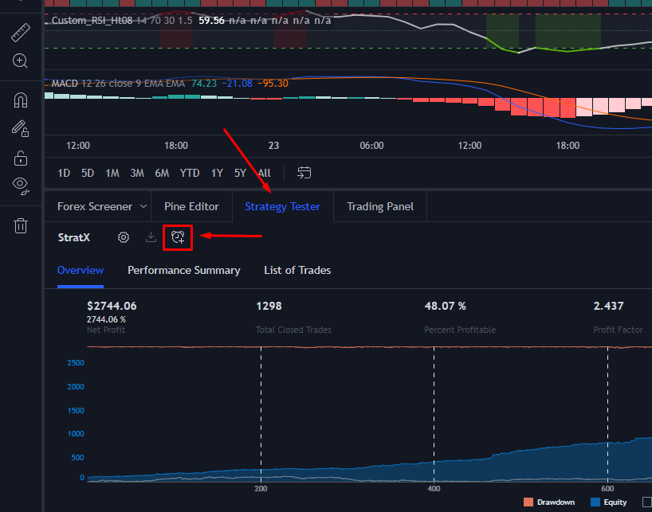
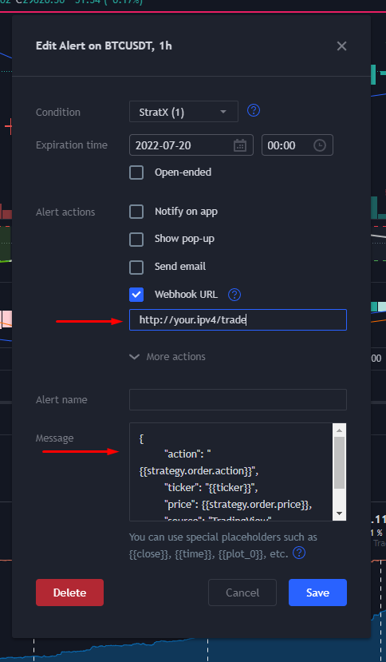

## TradingViewHook

This is a bot that accepts requests from [TradingView](https://www.tradingview.com/) strategies and executes buy/sell orders on Binance based on the webhook POST data.

# Benefits
- Customize any strategy you want in TradingView to your liking, and it will work with the bot
- Access TradingView **web panel** anywhere in the world, and instantly update your bot's strategy
- Easily manage your bot's strategy from the web, and get accurate and instant back-test results
- Stop or intervene at **anywhere**, **anytime** by simply disabling or pausing your alerts on TradingView
- Easily trade **multiple** coins or time-frames at once (Just add multiple alerts)

# Usage
1. Download the latest build _(No public JAR available yet, clone the repo if you know how to build one for yourself)_
2. Input your Binance API key and secret in the `login.yml` file
3. Customize the `config.yml` file to your liking
4. Run the bot with `java -jar tradingviewbot.jar`
5. Head over to the TradingView web panel, make sure you are on your desired time-frame and coin, add your strategy to the chart, and in the **Strategy Tester** tab, click on the Create Alert button (Alarm Clock)



6. In the edit alert modal:
  - Set the expiration time as far ahead as possible (Or if you have a paid account, check the Open-ended box) 
  - Check the **Webhook URL** box
  - Copy the _public_ url given to you by the bot, and paste it into the box below the checkbox
  - In the message box, paste the following template in. Set the token field to a secure string of your choosing, make sure this matches the config.yml's `server.token` field (Note, requests are also only allowed from TradingView whitelisted IP's)
      ```text
      {
          "action": "{{strategy.order.action}}",
          "type": "{{strategy.market_position}}",
          "currency": "{{ticker}}",
          "price": {{strategy.order.price}},
          "token": "(your-random-string-here)"
      }
       ```
  - Click the **Save** button



7. **Profit**

# Toubleshooting
- Make sure that your server's url can be reached publicly
- **If you are testing the endpoint**: The server does not respond to requests with an un-whitelisted IP. (Even localhost)
- **YOU MAY NEED TO PORT FORWARD** (If running on home network and not a dedicated server or VPS)
- TradingView only allows you to use webhook alerts on a **premium** account at around $10/month
- TradingView may not be able to reach your server, if you are behind a firewall or proxy.
- TradingView only supports ports 80 and 443
- TradingView does not support IPv6
